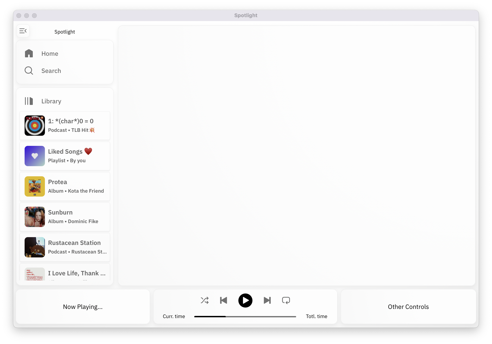
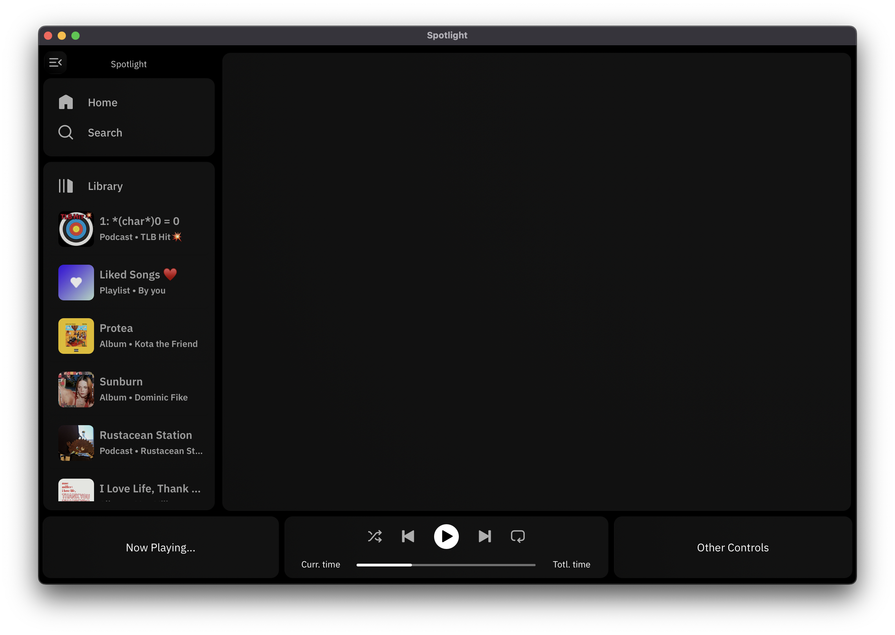

# Spotlight - Spotify Client

## Why a Spotify Client?

1. I use light mode during the day, dark mode at night. Light mode has been a requested feature of Spotify for [nearly a decade](https://community.spotify.com/t5/Live-Ideas/All-Platforms-Light-Mode-option/idi-p/730341), clearly they don't have intentions of bringing light mode to the app so I'll do it myself.

2. Spotify's web and desktop client's vary significantly from the mobile (iOS) app and are worst-off because of it, such as a lack of a *What's New* feed on the on mobile.

### Current State

- Recent effort has been focused on front-end work to make backend testing easier.
- Back-end is being worked out and will remain in a evolving mess untill an a arch design is commited to. 

